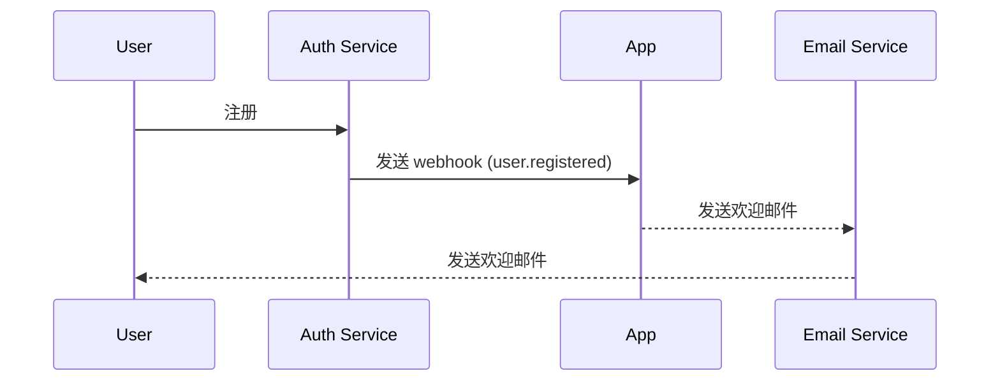

## 什么是 webhook？

Webhook 是一种 HTTP 回调机制，允许应用程序在特定事件发生时向预定义的 URL 发送实时通知。此机制实现了系统之间的自动数据交换和实时通信。

## Webhook 如何工作？


1. 在源系统中发生特定事件
2. 源系统构建包含事件数据的 HTTP POST 请求
3. 源系统将请求发送到预配置的目标系统 URL
4. 目标系统接收请求并处理数据
5. 目标系统向源系统返回响应
6. 如果请求失败，源系统可以实施重试机制

## Webhook 在现实场景中如何工作？

让我们以一个与 auth 服务集成的应用程序为例。当有新用户注册时，应用程序会向用户发送欢迎邮件。

通常，auth 服务提供一个 `user.registered` webhook 事件，当新用户完成注册时触发。

Webhook 事件负载包含用户的信息，如电子邮件和用户名，可用于发送欢迎邮件：

```json
// 注意：实际的负载结构取决于 auth 服务。
{
  "event": "user.registered",
  "timestamp": "2024-03-21T08:00:00Z",
  "data": {
    "user_id": "u_1234567890",
    "email": "john@example.com",    // 用于发送欢迎邮件的电子邮件地址
    "username": "johndoe",          // 用于个性化邮件的用户名
    "registered_at": "2024-03-21T08:00:00Z"
  }
}
```

以下是 webhook 流程的工作方式：



## 实施 webhook 的最佳实践是什么？

当你是 webhook 的发送者（生产者）时，考虑以下方面：

### Webhook 设计

设计清晰且一致的 webhook 结构：

- 定义清晰的事件类型：例如，`order.created`，`user.updated` 等。
- 使用标准 JSON 格式：确保数据结构清晰且易于解析。
- 版本控制：在请求头或负载中包含版本信息。例如：

  ```javascript
  // 在请求头中
  headers: {
    'Content-Type': 'application/json',
    'X-Webhook-Version': '1.0'
  }
  
  // 或在负载中
  {
    "version": "1.0",
    "event_type": "order.created",
    "data": {
      // 事件详情
    }
  }
  ```

- 提供足够的上下文：包括事件发生的时间戳、相关资源的唯一标识符等。
- 保持一致性：在所有事件类型中使用一致的命名约定和数据结构。

### 发送机制

实施可靠的 webhook 发送机制：

- 使用异步任务队列：避免阻塞主程序并提高系统响应能力。
- 实施重试机制：处理网络故障或接收者的临时不可用。

### 重试策略

设计合适的重试策略：

- 实施指数退避：避免频繁重试对系统和接收者造成压力。
- 设置最大重试次数：防止无限重试消耗系统资源。
- 提供手动重试机制：为最终失败的 webhook 提供手动重试的接口。

### 安全实施

实施签名机制以允许接收者验证请求的真实性：

```javascript
const crypto = require('crypto');

function generateSignature(payload, secret) {
  return crypto.createHmac('sha256', secret)
    .update(JSON.stringify(payload))
    .digest('hex');
}

function sendWebhookWithSignature(url, payload, secret) {
  const signature = generateSignature(payload, secret);
  return axios.post(url, payload, {
    headers: { 'X-Webhook-Signature': signature }
  });
}
```

### 性能优化

优化 webhook 发送性能：

- 使用连接池：减少建立连接的开销并提高性能。
- 实施批处理：在适当时以批处理方式发送 webhook，以减少网络交互次数。

### 文档和测试工具

为 webhook 用户提供支持：

- 详细的 API 文档：包括所有可能的事件类型、请求格式和字段描述。
- 提供测试工具：实现 webhook 测试端点，允许用户模拟接收 webhook 通知。
- 示例代码：提供各种编程语言的集成示例。

## 使用 webhook 的最佳实践是什么？

当作为接收者（消费者）使用 webhook 时，考虑以下方面：

### 安全

由于接收 webhook 的端点通常是公开可访问的，安全是首要考虑的问题。注意以下几点：

- 验证请求的真实性：实施签名验证机制以确保请求来自预期的发送者。
  
  ```javascript
  const crypto = require('crypto');

  function verifySignature(payload, signature, secret) {
    const expectedSignature = crypto
      .createHmac('sha256', secret)
      .update(JSON.stringify(payload))
      .digest('hex');
    
    return crypto.timingSafeEqual(
      Buffer.from(signature),
      Buffer.from(expectedSignature)
    );
  }
  ```

- 使用 HTTPS：确保你的 webhook 接收端点使用 HTTPS，以防止数据在传输过程中被拦截或篡改。
- 实施 IP 白名单：仅接受来自可信 IP 地址的 webhook 请求，以降低攻击风险。

### 可靠性

确保可靠地处理接收到的 webhook：

- 实施幂等处理：设计系统以正确处理重复的 webhook 通知，因为发送者可能会重试失败的请求。
- 快速响应：在接收到 webhook 请求后立即返回响应（通常是 2xx 状态码），以防止发送者认为请求失败并触发重试。

### 性能

保持系统高效运行：

- 异步处理：在接收到 webhook 后，在后台执行实际数据处理，而不阻塞响应。
- 设置超时限制：为 webhook 处理设置合理的超时时间，以防止长时间运行的任务影响系统性能。

### 错误处理

适当地处理潜在的错误情况：

- 日志记录：详细记录接收到的 webhook 请求和处理过程，以便于问题调查。
- 优雅降级：在无法处理 webhook 时，具有适当的错误处理机制，以确保系统的其他部分不受影响。

### 版本兼容性

由于 webhook 格式可能会随时间变化：

- 处理版本信息：准备好处理不同版本的 webhook 格式。版本信息通常在 URL 或请求头中提供。
- 向后兼容：在更新 webhook 处理逻辑时，确保继续支持旧格式版本。

### 监控

持续监控 webhook 的接收和处理：

- 设置警报：对异常情况（如高失败率或异常流量）实施实时监控和警报。
- 性能指标：跟踪 webhook 处理的性能指标，如响应时间和成功率。

<Resources
  urls={[
    "https://docs.logto.io/docs/recipes/webhooks/",
    "https://docs.logto.io/docs/recipes/webhooks/securing-your-webhooks/",
    "https://en.wikipedia.org/wiki/Webhook"
  ]}
/>