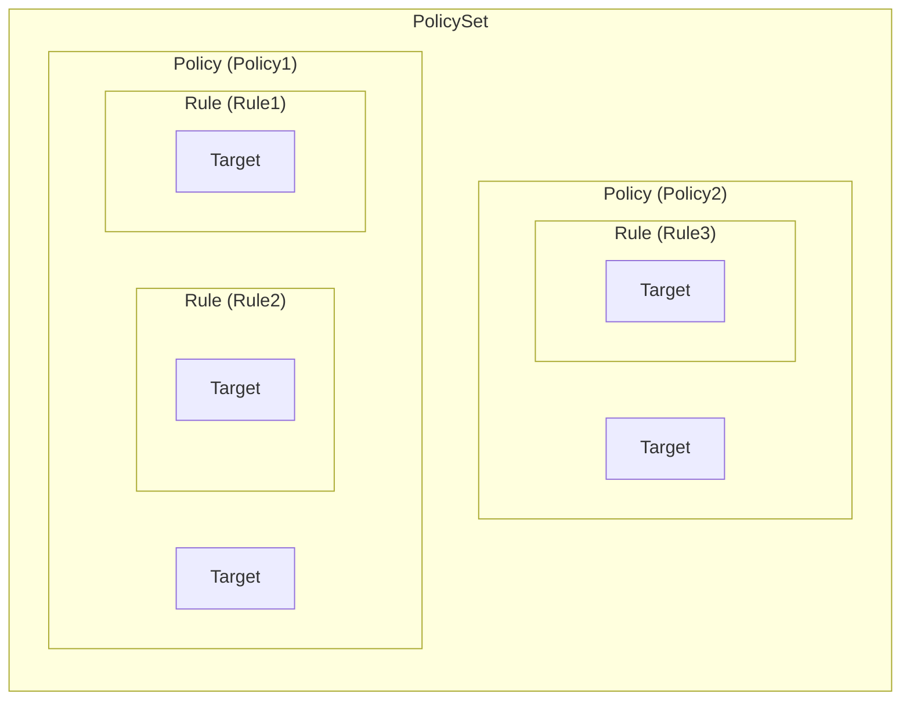
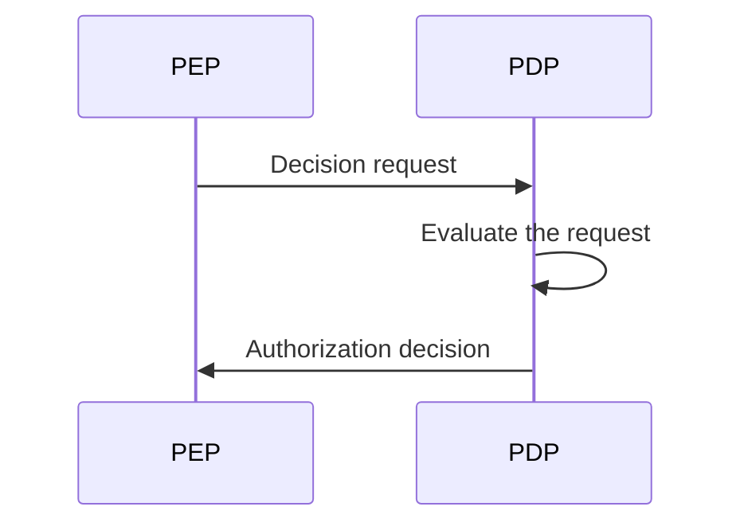
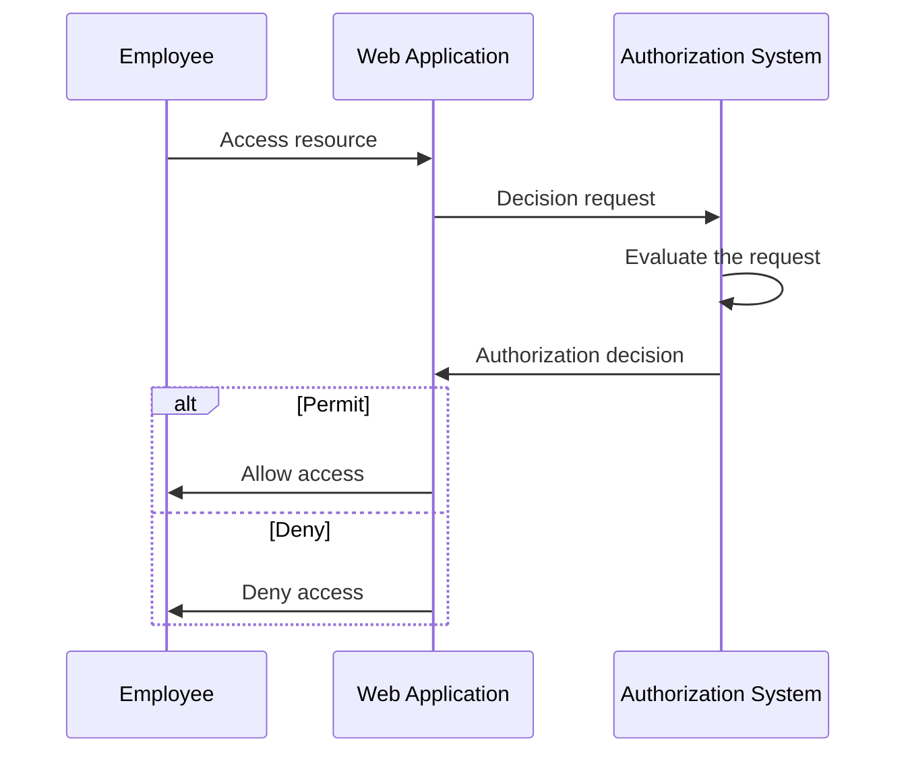
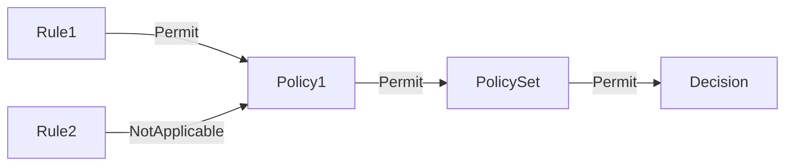
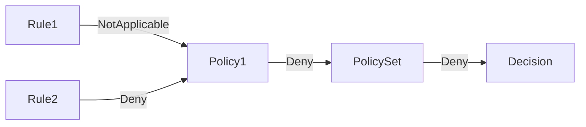
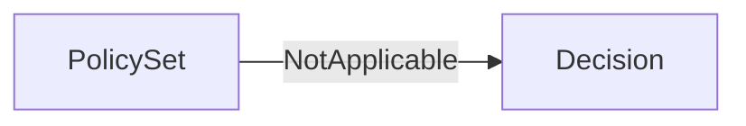

## 什么是 XACML？

顾名思义，可扩展访问控制标记语言 (XACML) 是一种主要用于访问控制的基于 XML 的语言。它是由结构化信息标准促进组织 (OASIS) 定义的标准。

[XACML 3.0](https://docs.oasis-open.org/xacml/3.0/xacml-3.0-core-spec-os-en.html) 是该标准的最新版本，于 2013 年发布。虽然它未指定特定的访问控制模型，XACML 通常用于实现 <Ref slug="abac" /> 策略。让我们来看一个简单的示例，了解如何使用 XACML 表示 ABAC 策略：

```xml
<PolicySet PolicySetId="ABAC_Policies" PolicyCombiningAlgId="urn:oasis:names:tc:xacml:3.0:policy-combining-algorithm:deny-overrides">
  <Description>ABAC Policies</Description>
  <Policy PolicyId="Policy1" RuleCombiningAlgId="urn:oasis:names:tc:xacml:3.0:rule-combining-algorithm:deny-overrides">
    <Description>Employees can read data</Description>
    <Target>
      <AnyOf>
        <AllOf>
          <Match MatchId="urn:oasis:names:tc:xacml:1.0:function:string-equal">
            <AttributeValue DataType="http://www.w3.org/2001/XMLSchema#string">read</AttributeValue>
            <AttributeDesignator
              AttributeId="urn:oasis:names:tc:xacml:1.0:action:action-id"
              Category="urn:oasis:names:tc:xacml:3.0:attribute-category:action"
              DataType="http://www.w3.org/2001/XMLSchema#string"
              MustBePresent="true"
            />
          </Match>
        </AllOf>
      </AnyOf>
    </Target>
    <Rule RuleId="Rule1" Effect="Permit">
      <Target>
        <AnyOf>
          <AllOf>
            <Match MatchId="urn:oasis:names:tc:xacml:1.0:function:string-equal">
              <AttributeValue DataType="http://www.w3.org/2001/XMLSchema#string">employee</AttributeValue>
              <AttributeDesignator
                AttributeId="urn:oasis:names:tc:xacml:1.0:subject:subject-id"
                Category="urn:oasis:names:tc:xacml:1.0:subject-category:access-subject"
                DataType="http://www.w3.org/2001/XMLSchema#string"
                MustBePresent="true"
              />
            </Match>
          </AllOf>
        </AnyOf>
      </Target>
    </Rule>
    <Rule RuleId="Rule2" Effect="Deny">
      <Target>
        <AnyOf>
          <AllOf>
            <Match MatchId="urn:oasis:names:tc:xacml:1.0:function:string-equal">
              <AttributeValue DataType="http://www.w3.org/2001/XMLSchema#string">user</AttributeValue>
              <AttributeDesignator
                AttributeId="urn:oasis:names:tc:xacml:1.0:subject:subject-id"
                Category="urn:oasis:names:tc:xacml:1.0:subject-category:access-subject"
                DataType="http://www.w3.org/2001/XMLSchema#string"
                MustBePresent="true"
              />
            </Match>
          </AllOf>
        </AnyOf>
      </Target>
    </Rule>
  </Policy>
  <!-- ...other policies... -->
</PolicySet>
```

XACML 在自解释命名约定方面表现良好。该语言设计为人类可读且易于理解。

简而言之，该策略规定员工可以读取数据，用户被拒绝读取数据。让我们通过分析关键组件来分解这个策略：

- `<PolicySet>`: 策略集的根元素。一个 `PolicySet` 可以包含多个 `Policy` 和 `PolicySet` 元素，形成策略的层次结构。
- `<Policy>`: 包含一个或多个规则的策略。每个策略可以有：
  - 指定策略适用条件的 `Target` 元素。
  - 定义访问控制规则的多个 `Rule` 元素。
  - 指定如何组合规则以做出决策的 `RuleCombiningAlgId` 属性。
- `<Rule>`: 定义访问被允许或拒绝条件的规则。每条规则有：
  - 指定规则适用条件的 `Target` 元素。
  - 指定规则是允许还是拒绝访问的 `Effect` 属性。

> [!Note]
> XACML 中可用的组件和属性不限于我们刚刚提到的那些。查看 [XACML 3.0 规范](https://docs.oasis-open.org/xacml/3.0/xacml-3.0-core-spec-os-en.html) 以获取完整的元素和属性列表。

下图是不同关键组件之间关系的图形表示：



将在后续章节中详细解释示例中的其他元素和属性。

## XACML 如何工作

为简单起见，假设在上述策略集中仅定义了一条策略。要触发策略评估过程，需要从**策略实施点 (PEP)** 向**策略决策点 (PDP)** 发送一个**决策请求**。PDP 会根据策略评估请求并将**授权决策**返回给 PEP。



- PEP: 向 PDP 发送决策请求并执行授权决策的组件（即进行 <Ref slug="access-control" />）。
- PDP: 根据策略评估决策请求并返回授权决策的组件。

让我们用一个真实的例子来替代莎士比亚式的语言。假设有一个允许员工访问某些资源的 Web 应用程序，该应用程序与基于 XACML 的授权系统集成。

当员工尝试访问资源时，Web 应用程序（**PEP**）向授权系统（**PDP**）发送一个**决策请求**。一旦授权系统根据 XACML 策略评估请求，它就会将**授权决策**返回给 Web 应用程序。



## 决策请求

XACML 中的决策请求由以下关键组件组成：

- **Subject**: 请求访问资源的实体。可以是用户、设备或任何其他实体。
- **Resource**: 被访问的资源。可以是文件、数据库、API 端点或任何其他资源。
- **Action**: 在资源上执行的操作。可以是读取、写入、删除或任何其他操作。
- **Environment**: 发出访问请求的上下文。可以包括时间、地点或任何其他上下文信息。

以下是 XACML 中决策请求的示例：

```xml
<Request>
  <Attributes Category="urn:oasis:names:tc:xacml:3.0:attribute-category:resource">
    <Attribute AttributeId="urn:oasis:names:tc:xacml:1.0:resource:resource-id" DataType="http://www.w3.org/2001/XMLSchema#string">
      <AttributeValue>http://example.com/data</AttributeValue>
    </Attribute>
  </Attributes>
  <Attributes Category="urn:oasis:names:tc:xacml:3.0:attribute-category:action">
    <Attribute AttributeId="urn:oasis:names:tc:xacml:1.0:action:action-id" DataType="http://www.w3.org/2001/XMLSchema#string">
      <AttributeValue>read</AttributeValue>
    </Attribute>
  </Attributes>
  <Attributes Category="urn:oasis:names:tc:xacml:3.0:attribute-category:subject">
    <Attribute AttributeId="urn:oasis:names:tc:xacml:1.0:subject:subject-id" DataType="http://www.w3.org/2001/XMLSchema#string">
      <AttributeValue>employee</AttributeValue>
    </Attribute>
  </Attributes>
</Request>
```

## 评估过程

一旦 PDP 检索到策略集，它将按如下方式评估决策请求：

1. **目标匹配**: 对于每个策略，PDP 检查请求是否匹配策略的目标。如果请求与目标匹配，PDP 将继续评估规则。
2. **规则评估**: PDP 评估策略中的每条规则。如果规则的目标与请求匹配，PDP 将评估规则的条件。如果条件为 `true`，PDP 将返回规则的效果（允许或拒绝）。如果条件为 `false`，PDP 将继续评估下一条规则。
3. **规则组合**: PDP 根据策略的 `RuleCombiningAlgId` 属性组合所有规则的效果。组合后的效果作为策略的决策返回。
4. **策略组合**: 如果策略集中包含多个策略，PDP 根据策略集的 `PolicyCombiningAlgId` 属性组合所有策略的决策。组合后的决策作为最终的授权决策返回。

### 示例 1

例如，在示例策略集中，假设决策请求如上。PDP 将按如下方式评估与 `Policy1` 策略的请求：

#### 目标匹配

策略的 `Target` 指定任何具有操作 ID 为 `read` 的主体都应由策略评估。由于请求的操作是 `read`，请求与策略的目标匹配。

#### 规则评估

策略包含两条规则：

1. `Rule1`: 由于请求的主体 ID 是 `employee`，规则的条件评估为 `true`，规则的效果是 `Permit`。
2. `Rule2`: 由于请求的主体 ID 不是 `user`，规则的条件评估为 `false`，规则的效果是 `NotApplicable`。

#### 规则和策略组合

- 由于 `Policy1` 使用 `deny-overrides` 规则组合算法，策略决策为 `Permit`，因为 `Rule1` 允许访问，其效果覆盖了 `Rule2` 的 `NotApplicable` 效果。
- 策略集也使用 `deny-overrides` 策略组合算法，最终决策是 `Permit`，因为策略决策是 `Permit`。

这是该评估过程的非规范图形表示：



### 示例 2

现在，考虑一个不同的决策请求，所有其他属性相同，但主体 ID 是 `user` 而不是 `employee`。

#### 目标匹配

由于操作未更改，请求仍与策略的目标匹配。

#### 规则评估

- `Rule1`: 请求的主体 ID 不是 `employee`，规则的条件评估为 `false`，规则的效果是 `NotApplicable`。
- `Rule2`: 请求的主体 ID 是 `user`，规则的条件评估为 `true`，规则的效果是 `Deny`。

#### 规则和策略组合

- 策略决策是 `Deny`，因为 `Rule2` 拒绝访问，并且其效果覆盖了 `Rule1` 的 `NotApplicable` 效果。
- 最终决策是 `Deny`，因为策略集的 `deny-overrides` 策略组合算法返回最严格的决策。

这是该评估过程的非规范图形表示：



### 示例 3

最后，考虑一个决策请求，其中操作是 `write` 而不是 `read`。所有其他属性保持与示例 1 相同。

#### 目标匹配

由于操作是 `write`，请求不再匹配策略的目标。因此，策略不被评估。

#### 规则和策略组合

由于未评估策略，最终决策是 `NotApplicable`。

这是该评估过程的非规范图形表示：



## 组合算法

XACML 定义了几种标准组合算法，这些算法决定了如何组合多个规则或策略的效果以做出决策。在上述示例中，我们提到了 `deny-overrides` 组合算法用于规则和策略。

顾名思义，`deny-overrides` 算法在 `Deny` 决策中优先于 `Permit` 决策。以下是 `deny-overrides` 算法的简要说明：

- 如果任何规则或策略拒绝访问，最终决策是 `Deny`；
- 如果没有规则或策略拒绝访问，并且至少一个规则或策略允许访问，最终决策是 `Permit`；
- 如果没有规则或策略拒绝访问，也没有规则或策略允许访问，最终决策是 `NotApplicable`。

实际算法更为复杂，并考虑其他 "不确定" 的决策，如 `Indeterminate{D}` 和 `Indeterminate{P}`。

> [!Note]
> 此算法在没有规则或策略匹配请求的情况下不提供“回退”决策。在这种情况下，决策是 `NotApplicable`。

有关组合算法及其行为的完整列表，请参阅 [XACML 3.0 规范](https://docs.oasis-open.org/xacml/3.0/xacml-3.0-core-spec-os-en.html#_Toc325047268)。

## 实施注意事项

XACML 是一种用于表示基于属性的访问控制策略的强大语言。在你的系统中实施 XACML 之前，请考虑以下几点：

- 访问控制设计：XACML 灵活且具有表现力，但它需要谨慎设计，因为其可能涉及复杂的策略集，可能导致意外的后果。
- 复杂性：XACML 策略通常很复杂，可能难以管理。对于大多数应用程序，较简单的访问控制模型如 <Ref slug="rbac" /> 可能更为合适。
- 性能：评估 XACML 策略可能在计算上代价高昂，尤其是在处理大型策略集时。在系统中使用 XACML 时，请考虑性能影响。

<SeeAlso slugs={['abac', 'rbac', 'access-control', 'authorization']} />

<Resources
  urls={[
    'https://docs.oasis-open.org/xacml/3.0/xacml-3.0-core-spec-os-en.html',
  ]}
/>